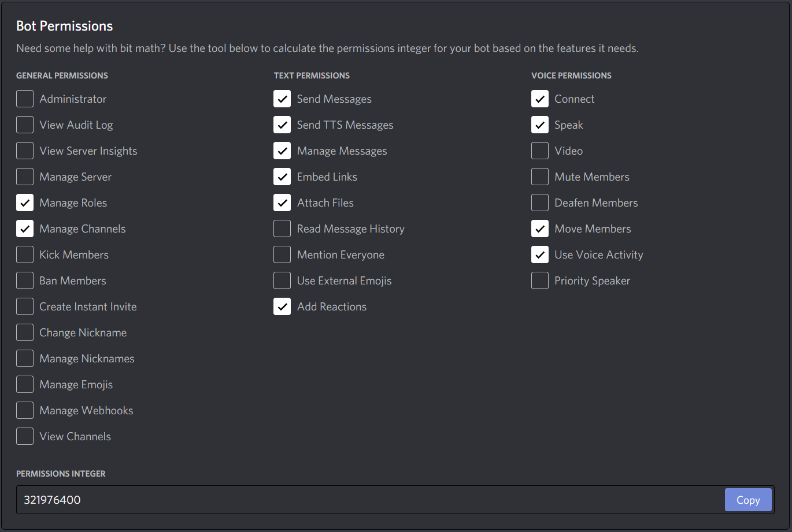

# TellME
CSCM69 Group Project

> TELLME.PY
> AIN'T NOTHING BUT A HEARTACHE
> TELLME.PY
> AIN'T NOTHING BUT A MISTAKE

## Installation

Ensure [Python3.7](https://python.org/) is installed. Tentatively, Python3.8 should work, but because Tensorflow is awkward we can't just blanket say "Python3.7 or later", since 3.9 doesn't work for now.

Install [Poetry](https://python-poetry.org/), open the `$ poetry shell` in the project directory (handles venv etc.), and use `$ poetry install`.

Install `libopus0`/`libopus` (depending on system) and `ffmpeg`.

Have a `token.txt` file available that has your Discord Bot token, and an `owner.txt` file with your Discord User ID.

Naturally, the bot needs to be invited to the server. Currently, these are the expected permissions (321976400):

## Running

While in the poetry shell, use `$ poetry run python3 tellme.py`

The bot is online and, if connected to your server, will login. Type `!play` when all players are in voice-chat with you and the game will commence. (TEMP: Assuming roles and channel names, a todo is to have the bot perform all setup)

***

### Style-guide

- Strings use `"`, not `'`, such as `"hello, world"`
  - I'm a C programmer, `'` means single character to me
- f-strings `f"` are preferred and superior, `.format()` only if absolutely necessary
  - `'` are allowed in f-strings to aid nesting / avoid `f"""` everywhere, nowhere else
- Indentation is 2-space and only 2-space, 4 is right out, 8 is insane, and if I see a tab then python will crash
- Please have a space after any comments, `# NOTE:` is more readable than `#NOTE:`
- That's it, really, I just like a little consistency and cleanliness
